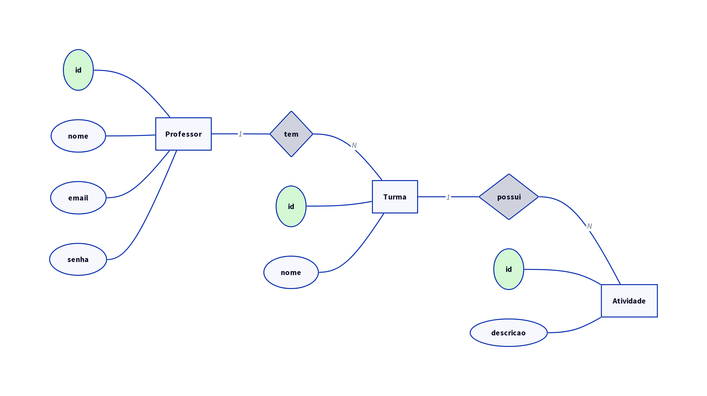
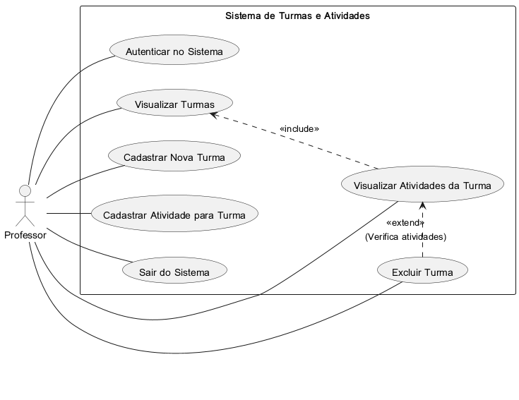

# 📚 Sistema de Gerenciamento de Turmas e Atividades

Um sistema completo para gerenciamento de turmas e atividades escolares, com perfis de Professor e Aluno. Professores podem criar e gerenciar turmas e atividades, enquanto alunos têm acesso limitado.

## 🖼️ Diagramas

### Modelo Entidade-Relacionamento (MER)


### Diagrama de Casos de Uso


## ✨ Funcionalidades

- **Autenticação**: Login para Professores e Alunos
- **Gerenciamento de Turmas**: Criar, editar e visualizar turmas (apenas Professores)
- **Gerenciamento de Atividades**: Criar, editar e visualizar atividades por turma (apenas Professores)
- **Permissões**: Controle de acesso baseado no perfil do usuário

## 🛠️ Tecnologias Utilizadas

- **Backend**: Node.js, Express.js, Prisma ORM
- **Banco de Dados**: MySQL
- **Frontend**: HTML5, CSS3, JavaScript (Vanilla)
- **Ferramentas**: Prisma CLI, XAMPP

## 📋 Pré-requisitos

Antes de começar, certifique-se de ter instalado em sua máquina:

- [Visual Studio Code](https://code.visualstudio.com/) (ou outro editor de código)
- [Node.js](https://nodejs.org/pt) (versão 16 ou superior)
- [XAMPP](https://www.apachefriends.org/pt_br/index.html) (para MySQL)
- [Git](https://git-scm.com/) (para clonar o repositório)

## 🚀 Instalação e Configuração

Siga os passos abaixo para configurar o ambiente de desenvolvimento:

### 1. Clone o Repositório

Abra o terminal (Git Bash ou CMD) e execute:

```bash
git clone <URL_DO_REPOSITORIO>
cd <Nome da pasta>
```

### 2. Abra no VS Code

```bash
code .
```

### 3. Configure o Backend (API)

Abra um novo terminal no VS Code (Ctrl + Shift + `) e navegue para a pasta da API:

```bash
cd api
```

Instale as dependências:

```bash
npm install
```

Instale o Prisma globalmente (se ainda não tiver):

```bash
-npm i prisma -g
-npm init -y
-npm i express cors dotenv 
-npx prisma init --datasource-provider mysql
```

### 4. Configure o Banco de Dados

Certifique-se de que o XAMPP está rodando e o MySQL está ativo.

Inicialize o Prisma:

```bash
npx prisma init --datasource-provider mysql
```

Crie ou edite o arquivo `.env` na pasta `api` com a seguinte configuração:

```env
DATABASE_URL="mysql://root@localhost:3306/sistema_turma?schema=public&timezone=UTC"
```

> **Nota**: Substitua `sistema_turma` pelo nome do banco que você criou no phpMyAdmin do XAMPP.

Execute as migrações do banco:

```bash
npx prisma migrate dev --name init
```

Popule o banco com dados iniciais:

```bash
npx prisma db seed
```

## ▶️ Como Executar

### 1. Inicie a API

Na pasta `api`, execute:

```bash
npm start
```

Você verá a mensagem: `API respondendo em http://localhost:3005`

### 2. Abra a Interface Web

Abra o arquivo `web/login/index.html` diretamente no navegador (duplo clique ou arraste para o navegador).

> **Dica**: Para uma experiência melhor, use uma extensão como "Live Server" no VS Code para servir a pasta `web` em um servidor local.

### 3. Faça Login

Use as credenciais de exemplo:
- **Professor**: Email e senha conforme os dados seedados
- **Aluno**: Email e senha conforme os dados seedados

## 📖 Como Usar

1. **Login**: Entre com seu email e senha na tela de login.
2. **Turmas**: Visualize a lista de turmas. Professores podem criar novas turmas.
3. **Atividades**: Clique em uma turma para ver suas atividades. Professores podem adicionar novas atividades.

## 🤝 Contribuição

Contribuições são bem-vindas! Siga estes passos:

1. Fork o projeto
2. Crie uma branch para sua feature (`git checkout -b feature/nova-feature`)
3. Commit suas mudanças (`git commit -am 'Adiciona nova feature'`)
4. Push para a branch (`git push origin feature/nova-feature`)
5. Abra um Pull Request

## 📄 Licença

Este projeto está sob a licença ISC. Veja o arquivo `LICENSE` para mais detalhes.

## 👨‍💻 Desenvolvido por

João Angra

---

**Dúvidas?** Abra uma issue no repositório ou entre em contato com o desenvolvedor.
