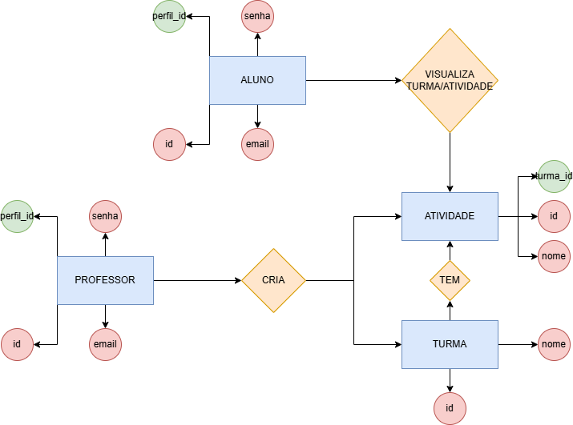
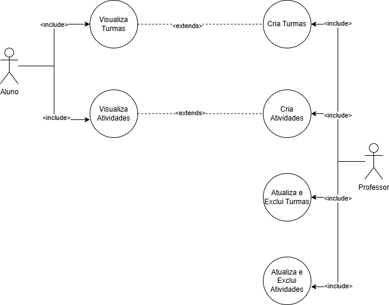

## Gerenciador de Turmas e Atividades
Gerenciador de Turmas e Atividades com usuario Professor e Aluno, Professor com certas permissões e Aluno tambem

### MerDer

### Diagrama de Casos de Uso


## Como testar 
1. Configure o ambiente de desenvolvimento com as seguintes ferramentas.

- [VsCode](https://code.visualstudio.com/)
- [XAMPP](https://www.apachefriends.org/pt_br/index.html)
- [NodeJS](https://nodejs.org/pt)

2. Após a instalação das ferramentas siga esse passo para clonar o repositorio e testa-ló.

- Copie o codigo HTTP no GitHub do repositorio que queira testar, abra o Git Bash em sua area de trabalho e coloque o seguinte codígo

```bash
git clone <https://url>
```

- Agora com o repositorio clonado, entre nela com o seguinte comando

```bash
cd <nomedoarquivo>
```

- Agora dentro do arquivo clonado pelo Git Bash, digite esse comando para abri-lo no VsCode

```bash
code .
```

- Com o arquivo aberto no VsCode, abra o CMD (CRTL+"), e coloque os seguinte comandos na ordem que aparecem logo abaixo

```bash
cd api
npm i prisma -g
npm init -y
npm i express cors dotenv 
npx prisma init --datasource-provider mysql
```

- Apos colocar os comandos em ordem no CMD crie um pasta chamada .env (caso os comandos dados ja tenham criado não será necessario)

```bash
DATABASE_URL="mysql://root@localhost:3306/techman?schema=public&timezone=UTC"
```

- Faremos a migração do banco de dados para o MySQL através do comando a seguir no terminal

```bash
npx prisma migrate dev --name init
```

- Caso seja de interesse, coloque seu email para conectar o Git ao GitHub

```bash
git config --global user.email "seu-email@exemplo.com"
```

#### Desenvolvido por Pedro Duarte